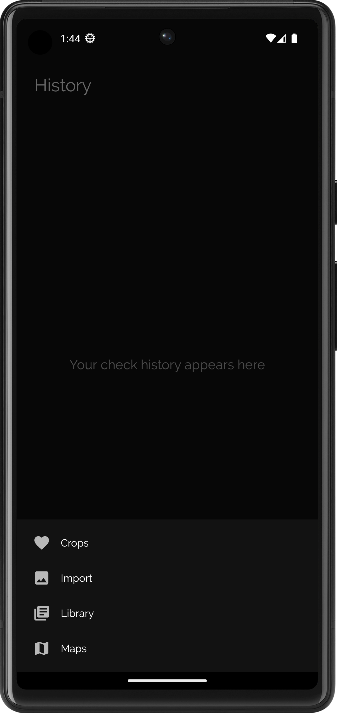

# PlantPlanet
PlantPlanet is an Android application for plant disease detection. This project is part of [my participation](https://eucys.eu/projects-2019/plantplanet/) in EU Contest for Young Scientists 2019 in Sofia, Bulgaria.

## Screenshots

  
  
  

  
  
  

  
  
  

## Features
- Plant disease detection
- Plant disease library
- Plant disease map
- Plant disease history
- Offline functionality
- Text-to-speech functionality

## Plant disease detection
[The app's plant disease detection model](https://www.kaggle.com/code/abdallahalidev/plantplanet) was trained based on [InceptionV3](https://github.com/MarkoArsenovic/DeepLearning_PlantDiseases) using [PlantVillage Dataset](https://github.com/spMohanty/PlantVillage-Dataset). The trained model was converted into a [TensorFlow Lite](https://www.tensorflow.org/lite) model, which is compatible to be run on mobile devices.

## Libraries

- [Firebase Firestore](https://firebase.google.com/docs/firestore)
- [Firebase Storage](https://firebase.google.com/docs/storage)
- [Firebase MLKit](https://firebase.google.com/docs/ml-kit)
- [Google Maps API](https://developers.google.com/maps)
- [Fotoapparat](https://github.com/RedApparat/Fotoapparat)
- [Picasso](https://github.com/square/picasso)

# Installation

